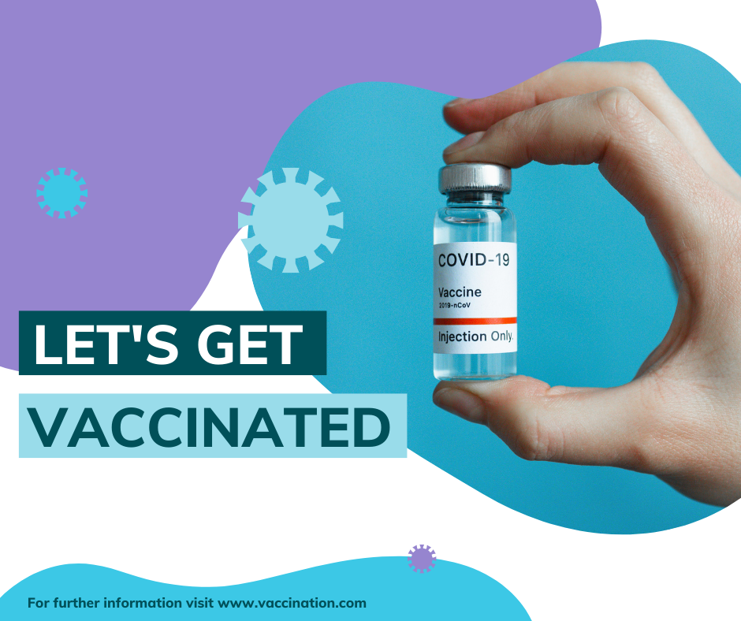
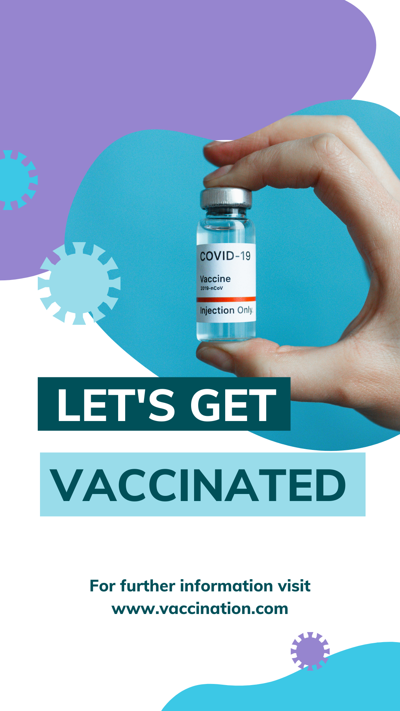

## Planeación de marketing

La planeación para esta campaña de vacunación, se basará principalmente en la difusión de la información a través de los medios digitales como son las redes sociales. Ya que con estos, podemos alcanzar una mayor audiencia para difundir información importante acerca de las vacunas, desde la importancia hasta los puntos donde pueden asistir a vacunarse. 

Todo esta información estará en una página web con diferentes secciones que contiene la información antes mencionada.

### Diseños de redes sociales

A continuación se muestran algunos ejemplos de los diferentes anuncios que se publicarán en instagram y facebook, haciendo uso de la herramienta de paga para alcanzar la mayor audiencia posible.

